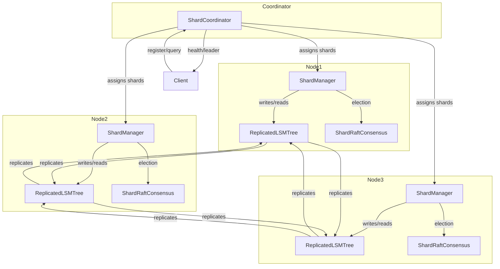

# LSMTree Distributed Timeseries Database: Deep Dive Architecture

---

## 1. **High-Level Overview**

LSMTree is a distributed, sharded, and replicated timeseries database built on the Log-Structured Merge Tree (LSM) storage model. It is designed for high write throughput, horizontal scalability, and high availability. The system achieves this through:

- **Sharding:** Horizontal partitioning of data by metric (or other keys).
- **Replication:** Each shard is replicated across multiple nodes for fault tolerance.
- **Source Coordination:** A central coordinator manages shard assignments, leader election, and cluster membership.
- **Raft Consensus:** Per-shard leader election and consistency using Raft.

---

## 2. **Core Components**

### 2.1. **ShardCoordinator**
- **Role:** Central authority for cluster membership, shard assignment, leader tracking, and routing.
- **Responsibilities:**
  - Registers and unregisters nodes.
  - Assigns shards to nodes and manages replication groups.
  - Tracks the leader and replicas for each shard.
  - Monitors node and shard health.
  - Triggers per-shard leader elections as needed.
  - Provides routing information to clients and nodes.

### 2.2. **CoordinatorController**
- **Role:** REST API for the coordinator.
- **Responsibilities:**
  - Exposes endpoints for node registration, shard map queries, leader lookups, and health checks.
  - Allows external systems and nodes to interact with the coordinator.

### 2.3. **ShardManager**
- **Role:** Node-local manager for assigned shards.
- **Responsibilities:**
  - Registers the node with the coordinator on startup.
  - Manages local LSM trees for each assigned shard.
  - Handles local Raft consensus for each shard.
  - Forwards writes to the correct local LSM tree if the node is the leader for the shard.

### 2.4. **ShardRaftConsensus**
- **Role:** Per-shard Raft consensus instance.
- **Responsibilities:**
  - Handles leader election and term management for a specific shard.
  - Ensures consistency and failover within the shard's replication group.

### 2.5. **ReplicatedLSMTree**
- **Role:** Storage engine for each shard.
- **Responsibilities:**
  - Implements the LSM tree data structure.
  - Handles write-ahead logging, memtable, SSTable, and compaction.
  - Replicates writes to follower nodes in the shard's replication group.

### 2.6. **ClusterMembership & NodeInfo**
- **Role:** Track cluster nodes and their status.
- **Responsibilities:**
  - Maintain a registry of all nodes, their health, and their roles (leader/follower).
  - Used by both the coordinator and nodes for membership and health checks.

---

## 3. **Data Flow**

### 3.1. **Node Startup**
1. Node starts and instantiates `ShardManager`.
2. `ShardManager` registers the node with the `ShardCoordinator` via REST.
3. `ShardCoordinator` assigns a set of shards to the node and returns assignment info.
4. `ShardManager` initializes a `ReplicatedLSMTree` and `ShardRaftConsensus` for each assigned shard.

### 3.2. **Write Path**
1. **Client** wants to write a point for a metric.
2. **Client** queries the `CoordinatorController` for the leader of the relevant shard (using the metric name).
3. **Client** sends the write to the leader node for that shard.
4. **Leader node's ShardManager** writes the point to the local `ReplicatedLSMTree`.
5. **ReplicatedLSMTree** replicates the write to follower nodes in the shard's replication group.
6. **Followers** acknowledge the write; leader responds to the client based on the configured consistency level.

### 3.3. **Read Path**
1. **Client** queries the coordinator for the leader or a replica of the relevant shard.
2. **Client** sends the read to the chosen node.
3. **Node's ShardManager** reads from the local `ReplicatedLSMTree` and returns the result.

### 3.4. **Leader Election & Failover**
1. **Coordinator** monitors node and shard health.
2. If a leader node fails, the coordinator triggers a new leader election for the affected shard using `ShardRaftConsensus`.
3. The new leader is updated in the coordinator's shard map and advertised to clients.

### 3.5. **Node Join/Leave**
- **Join:** New node registers with the coordinator, receives shard assignments, and starts managing those shards.
- **Leave/Failure:** Coordinator detects node failure, reassigns its shards, and triggers leader elections as needed.

---

## 4. **Sharding and Replication**

### 4.1. **Sharding**
- **Partitioning:** Metrics are mapped to shards using a hash function (e.g., `shardId = hash(metricName) % numShards`).
- **Assignment:** Coordinator assigns shards to nodes, balancing load and replication factor.

### 4.2. **Replication**
- **Replication Factor:** Each shard is assigned to multiple nodes (e.g., 3).
- **Leader-Follower:** One node is the leader for each shard; others are followers.
- **Consistency:** Writes are acknowledged based on the configured consistency level (ONE, QUORUM, ALL).

---

## 5. **Source Coordination (ShardCoordinator) Deep Dive**

### 5.1. **Data Structures**
- `Map<Integer, ShardInfo> shardMap`: Tracks the state of each shard (leader, replicas, health).
- `Map<String, NodeInfo> nodeRegistry`: Tracks all nodes in the cluster.
- `Map<String, Set<Integer>> nodeToShards`: Tracks which shards are assigned to each node.

### 5.2. **Shard Assignment Algorithm**
- On node registration, shards are assigned in a round-robin or balanced fashion.
- Replication factor is maintained by assigning each shard to multiple nodes.

### 5.3. **Leader Election**
- If a leader fails, the coordinator selects a healthy replica and triggers a Raft election for that shard.
- The new leader is updated in the `shardMap`.

### 5.4. **Health Monitoring**
- Periodic checks ensure that all leaders and replicas are healthy.
- If a node or leader is unhealthy, the coordinator reassigns shards and triggers elections as needed.

### 5.5. **API Endpoints**
- **Register Node:** `POST /api/v1/coordinator/nodes`
- **Unregister Node:** `DELETE /api/v1/coordinator/nodes/{nodeId}`
- **Get Shard Map:** `GET /api/v1/coordinator/shard-map`
- **Get Leader for Metric:** `GET /api/v1/coordinator/leader?metric=...`
- **Trigger Election:** `POST /api/v1/coordinator/shard/{shardId}/election`
- **Health Check:** `GET /api/v1/coordinator/health`

---

## 6. **Node-Side Shard Management**

### 6.1. **ShardManager**
- Registers with the coordinator and receives assigned shards.
- Manages a `ReplicatedLSMTree` and `ShardRaftConsensus` for each shard.
- Handles local writes/reads and participates in Raft elections.

### 6.2. **ReplicatedLSMTree**
- Implements the LSM tree storage engine.
- Handles write-ahead logging, memtable, SSTable, and compaction.
- Replicates writes to followers using the `ReplicationManager`.

### 6.3. **ShardRaftConsensus**
- Runs a Raft consensus instance per shard.
- Handles leader election, term management, and log replication for the shard.

---

## 7. **Cluster Membership and Health**

- **ClusterMembership** tracks all nodes, their health, and their roles.
- **NodeInfo** contains node ID, host, port, and status.
- Used by both the coordinator and nodes for membership and health checks.

---

## 8. **Configuration**

- **application.yml** contains all configuration for sharding, replication, and cluster settings.
- Key sections:
  - `sharding:` (num-shards, replication-factor, health-check-interval)
  - `replication:` (consistency, timeouts, async/sync)
  - `cluster:` (node ID, host, port, heartbeat, election timeouts)

---

## 9. **Extensibility and Operations**

- **Adding Nodes:** Register with the coordinator; shards are rebalanced.
- **Scaling:** Increase `numShards` and/or add nodes for horizontal scaling.
- **Monitoring:** Use coordinator and node APIs for health, stats, and leader info.
- **Failover:** Automatic via health checks and Raft elections.

---

## 10. **Summary Diagram**

---

## 11. **Conclusion**

The LSMTree system is a robust, scalable, and highly available distributed timeseries database.  
- **ShardCoordinator** is the heart of source coordination, ensuring balanced sharding, reliable leader election, and seamless failover.
- **ShardManager** and **ReplicatedLSMTree** on each node provide efficient local storage and replication.
- **Raft** ensures strong consistency and automatic recovery from failures.

**This architecture enables you to scale horizontally, maintain high availability, and provide strong consistency guarantees for timeseries workloads.**

---

If you want a **deeper dive into any specific component, flow, or codebase area**, just ask! 